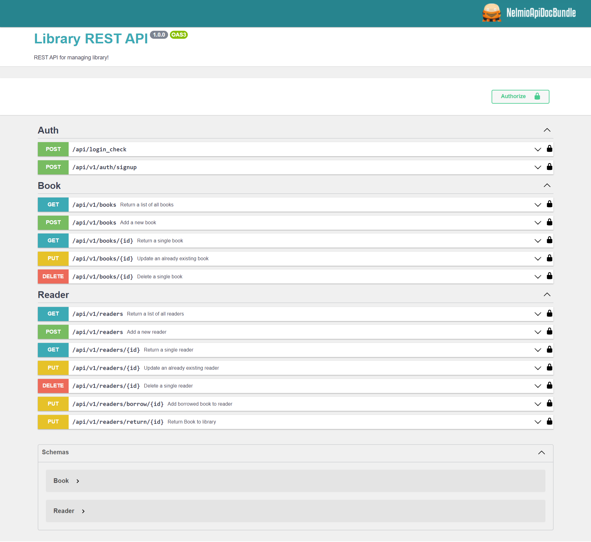

### The goal of this task is to create a simple RESTful application using PHP and Symfony, which will be used to manage a basic library system.

- **Models**:
  - Book: title, author, publication year, status (available/unavailable)  
  - Reader: first name, last name, email address, list of borrowed books
- **Functions**:   
  - Adding/Editing/Deleting/Browsing books  
  - Searching for books by title, author, publication year  >>>> **WIP**
  - Adding/Editing/Deleting/Browsing readers  
  - Borrowing a book by a reader (this should automatically change the book's status to 'unavailable')  
  - Returning a book by a reader (this should automatically change the book's status to 'available')  
- **Validation**:  
  - All model fields must be valid before saving them to the database.  
  - A reader cannot borrow more than 3 books at a time.  
  - A book cannot be borrowed if its status is 'unavailable'.  
- **Transactionality**:  
  - Borrowing and returning book operations should be conducted as transactions.  
- **Testing**:  
  - Prepare unit and functional tests to verify the correctness of the above functions. >>>> **WIP**

    
**Extra features**:  
- Using Docker to manage the application environment.
- Applying database migrations.
- Implementing authentication and authorization using JWT (JSON Web Tokens).
- Utilizing UUIDs instead of traditional IDs.


## Requirements
- [Composer](https://getcomposer.org/)
- [PHP 8.1](https://www.php.net/)
- [Docker](https://www.docker.com/)
- [Symfony CLI](https://symfony.com/download)

## Install
1. Clone the repository:
```sh
git clone https://github.com/TomaszSokalski/library-api.git
```
2. Access the directory:
```sh
cd library-api
```
3. Install the Composer dependencies:
```sh
composer install
```
4. Run docker image:
```sh
docker compose up -d
```
5. Create database and make migrations:
```sh
symfony console doctrine:database:create
symfony console doctrine:migrations:migrate
```
6. Load fixtures:
```sh
symfony console doctrine:fixtures:load
```
7. Generate JWT keys:
```sh
php bin/console lexik:jwt:generate-keypair  
```
8. Run server and go to UI:
```sh
symfony server:start -d
https://127.0.0.1:8000/api/doc
```

